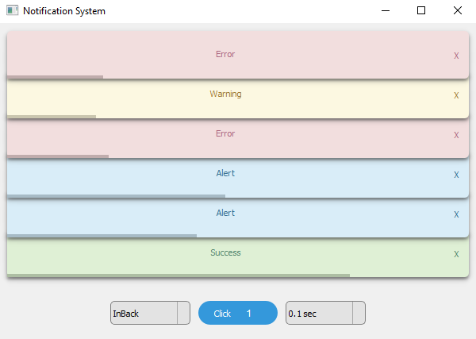
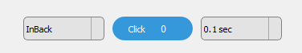
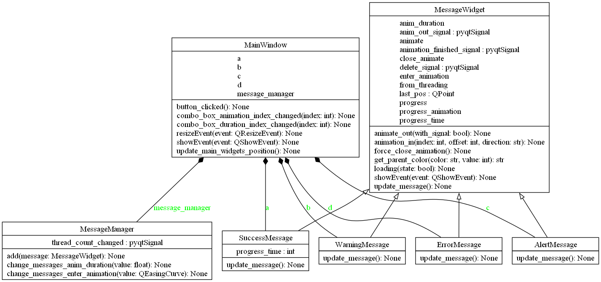

# Notification System

This software is a powerful and flexible library designed to generate notifications within interfaces built using PyQt5.
It allows developers to easily integrate and customize notification systems, enhancing the user experience by providing real-time updates and alerts. 


## Requirements

- PyQt5
- Python 3.7 +

## Installation

```bash
# clone the repository
git clone https://github.com/zTMF/Notification-System-PyQt5.git

# enter the project directory
cd Notification-System-PyQt5

# create venv
python -m venv venv

# install dependencies
pip install -r requirements.txt
```

## Usage
To run the demo just do the following
```bash
# run main.py
python main.py
```
The demo consists of a simple interface just to represent how the messages work with animations.



Just click on the blue button in the center of the screen to generate a message.

## Select Animation

- [QEasingCurve](https://doc.qt.io/qt-6/qeasingcurve.html)

Easing curves describe a function that controls how the speed of the interpolation between 0 and 1 should be.
Easing curves allow transitions from one value to another to appear more natural than a simple constant speed would allow. 
The QEasingCurve class is usually used in conjunction with the QVariantAnimation and QPropertyAnimation classes but can be used on its own. 
It is usually used to accelerate the interpolation from zero velocity (ease in) or decelerate to zero velocity (ease out).
Ease in and ease out can also be combined in the same easing curve.

Select an animation in the combobox on the left and the animation time in the combobox on the right.



Each time an option is changed, the messages are reset.


## Custom Usage

Create the message manager and then add the messages to it
```bash
# Set the maximum number of messages
# Pass the parent class as a parameter
message_manager = MessageManager(max_messages=6, parent=self)

# Create a message
message = SuccessMessage('Success', self)

# Add the message to the message manager
message_manager.add(current)
```

## UML

